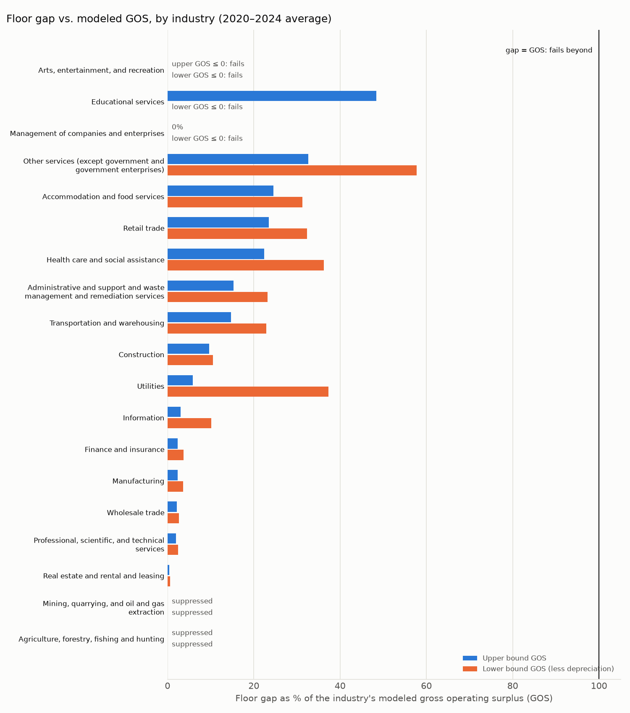
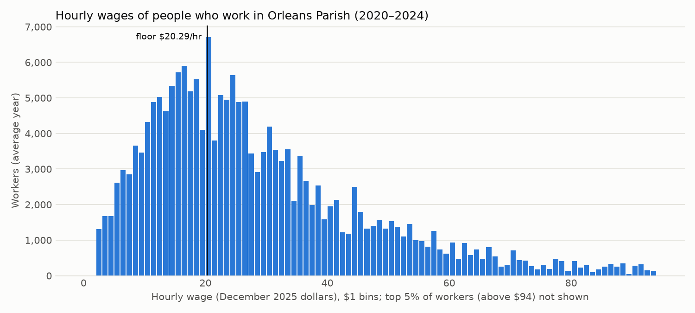

# Orleans Parish living-wage gap and capacity

Place of work, ACS PUMS 2020–2024 (average year) with 2022–2024 alongside; MIT living wage snapshot; BEA county and state accounts. Every estimate is ± 90% MOE. See SPEC.md for methods, qa.md for the QA log.

## Headline

In 2020–2024 (an average year), 72,897 ± 3,050 of the 195,275 ± 4,502 wage and salary workers whose job is in Orleans Parish (37.3% ± 1.2 pp) earned less than the MIT living-wage floor (1 adult, 0 children), $20.29 an hour in December 2025 dollars. Raising each of them to that floor for the hours they actually work would cost $953.9M ± $53.8M a year, 6.5% ± 0.4 pp of wage and salary disbursements. With the employer's share of payroll taxes (7.65%), the cost to employers is $1,026.9M ± $58.0M a year: 3.3% ± 0.2 pp of Orleans GDP and 5.8% ± 0.3 pp of employee compensation. Every comparison below uses that employer cost. Against modeled gross operating surplus (GOS, upper bound; lower bound nets out depreciation): (a) the private and nonprofit employer cost is 8.5% ± 0.5 pp of private-industry GOS (12.9% ± 0.8 pp at the lower bound), and (b) the all-sector employer cost is 8.9% ± 0.5 pp of total GOS (14.6% ± 0.8 pp at the lower bound). Excluding real estate and rental and leasing, whose GOS includes imputed rent on owner-occupied housing, (b) is 12.3% ± 0.7 pp (21.6% ± 1.2 pp at the lower bound). The government workers' employer cost would be a 3.2% ± 0.5 pp raise to government compensation. By the self-funding test (an industry fails when its employer cost exceeds its own GOS), 2 industries fail: Educational services (lower bound only)[^gos-low] and Arts, entertainment, and recreation (both bounds)[^gos-76][^gos-low]. Accommodation and food services, which SPEC §6 expected to fail, passes both bounds: its employer cost is 26.4% ± 3.1 pp of its upper-bound GOS and 33.6% ± 3.9 pp of its lower bound. Agriculture, forestry, fishing and hunting and Mining, quarrying, and oil and gas extraction cannot be tested because BEA suppresses a needed cell. The same industries fail on 2022–2024 averages. The 2022–2024 window gives 75,843 ± 3,792 workers below the floor and a $962.7M ± $63.3M gap. Paired on the same replicate weights (the windows share data), 2020–2024 minus 2022–2024 is −2,946 ± 2,223 workers below the floor (beyond its 90% MOE), −0.5 pp ± 0.9 pp in the share below (within its 90% MOE) and −$8.8M ± $42.0M in the total gap (within its 90% MOE), so the windows differ on workers below the floor but not on the share below or the total gap. Survey-reported wages for this universe fall 10.3% short of BEA wage and salary disbursements (3.9% short like-for-like, counting salaries that owners of incorporated businesses pay themselves, as BEA does); to the extent the survey under-reports pay, the gap is overstated. Measured instead as annual earnings against the floor × 2,080 hours, the gap is $1,639.3M ± $66.1M, $685.4M above the headline: 12.7 times the headline's MOE.

Reading the tables: "—" means not defined[^dash]; "suppressed" means BEA withheld a needed cell; "no sample" means no survey workers in that group. No unknown value is printed as 0.

## 1. Workers below the floor

| Measure | 2020–2024 | 2022–2024 |
|---|---:|---:|
| Wage and salary workers | 195,275 ± 4,502 | 200,452 ± 5,894 |
| Below the floor | 72,897 ± 3,050 | 75,843 ± 3,792 |
| Share below the floor | 37.3% ± 1.2 pp | 37.8% ± 1.5 pp |

By class of worker:

| Class of worker | Below 2020–2024 | Below 2022–2024 | Share 2020–2024 | Share 2022–2024 |
|---|---:|---:|---:|---:|
| nonprofit | 9,227 ± 902 | 10,153 ± 1,292 | 30.0% ± 2.6 pp | 31.8% ± 3.4 pp |
| private | 53,737 ± 2,778 | 54,298 ± 3,340 | 42.4% ± 1.7 pp | 42.1% ± 1.9 pp |
| public | 9,933 ± 969 | 11,392 ± 1,314 | 26.3% ± 2.2 pp | 28.8% ± 2.5 pp |

## 2. Total gap

| Measure | 2020–2024 | 2022–2024 |
|---|---:|---:|
| Total annual gap | $953.9M ± $53.8M | $962.7M ± $63.3M |
| Mean shortfall per affected worker, $/hr | $7.41 ± $0.19 | $7.39 ± $0.24 |
| Mean shortfall per affected worker, $/yr | $13,085 ± $466 | $12,694 ± $591 |

By class of worker:

| Class of worker | Gap 2020–2024 | Gap 2022–2024 |
|---|---:|---:|
| nonprofit | $110.9M ± $14.1M | $124.1M ± $22.1M |
| private | $726.7M ± $51.5M | $708.7M ± $53.7M |
| public | $116.3M ± $17.3M | $129.9M ± $24.1M |

## 3. Gap vs. GDP, compensation and GOS

| Ratio | 2020–2024 | 2022–2024 |
|---|---:|---:|
| All-sector employer cost ÷ GDP | 3.3% ± 0.2 pp | 3.3% ± 0.2 pp |
| All-sector employer cost ÷ employee compensation | 5.8% ± 0.3 pp | 5.9% ± 0.4 pp |
| All-sector gap ÷ wage and salary disbursements | 6.5% ± 0.4 pp | 6.6% ± 0.4 pp |
| (a) Private + nonprofit employer cost ÷ private GOS, upper bound | 8.5% ± 0.5 pp | 8.2% ± 0.6 pp |
| (a) Private + nonprofit employer cost ÷ private GOS, lower bound | 12.9% ± 0.8 pp | 12.4% ± 0.9 pp |
| (b) All-sector employer cost ÷ total GOS, upper bound | 8.9% ± 0.5 pp | 8.8% ± 0.6 pp |
| (b) All-sector employer cost ÷ total GOS, lower bound | 14.6% ± 0.8 pp | 14.3% ± 0.9 pp |
| (a) excluding Real estate and rental and leasing, upper bound | 12.0% ± 0.8 pp | 11.7% ± 0.8 pp |
| (a) excluding Real estate and rental and leasing, lower bound | 18.9% ± 1.2 pp | 18.1% ± 1.3 pp |
| (b) excluding Real estate and rental and leasing, upper bound | 12.3% ± 0.7 pp | 12.2% ± 0.8 pp |
| (b) excluding Real estate and rental and leasing, lower bound | 21.6% ± 1.2 pp | 21.0% ± 1.4 pp |
| Government employer cost ÷ government compensation | 3.2% ± 0.5 pp | 3.8% ± 0.7 pp |

Employer cost is the gap plus the employer's share of payroll taxes (7.65%); GDP, compensation and GOS all include those taxes. Wage and salary disbursements do not, so that row uses the gap alone. Rows (a), (b) and government use employer cost.

"Excluding Real estate and rental and leasing" removes that industry's gap from the numerator and its GOS from the denominator: its GOS includes imputed rent on owner-occupied housing.

BEA denominators (average year, December 2025 dollars; place of work):

| Measure | 2020–2024 | 2022–2024 |
|---|---:|---:|
| GDP (CAGDP2) | $30,909.0M | $31,518.5M |
| Employee compensation (CAINC6N) | $17,753.1M | $17,626.7M |
| Wage and salary disbursements (CAINC5N) | $14,615.0M | $14,554.3M |
| Total GOS, upper / lower bound | $11,488.6M / $7,016.6M | $11,734.7M / $7,245.0M |
| Private GOS, upper / lower bound | $10,618.4M / $7,016.6M | $10,886.5M / $7,245.0M |

## 4. Industries and the self-funding test

An industry fails when its employer cost (gap plus employer payroll taxes) exceeds its own modeled GOS. The ÷ columns use employer cost. The government line is excluded from the test ("n/a"; its BEA GOS is only depreciation) but its gap and gap ÷ compensation (payroll share) are shown.

| Industry (CAGDP2) | Below 2020–2024 | Gap 2020–2024 | Gap 2022–2024 | Gap ÷ comp 2020–2024 | Gap ÷ GOS upper 2020–2024 | Gap ÷ GOS lower 2020–2024 | Self-funding upper / lower 2020–2024 | Self-funding upper / lower 2022–2024 |
|---|---:|---:|---:|---:|---:|---:|---:|---:|
| Agriculture, forestry, fishing and hunting | 75 ± 50 | $1.1M ± $0.9M | $1.5M ± $1.5M | suppressed | suppressed | suppressed | suppressed / suppressed | suppressed / suppressed |
| Mining, quarrying, and oil and gas extraction | 222 ± 236 | $1.1M ± $1.5M | $0.1M ± $0.1M | suppressed | suppressed | suppressed | suppressed / suppressed | suppressed / suppressed |
| Utilities | 236 ± 174 | $2.4M ± $2.1M | $3.1M ± $3.4M | 4.7% ± 3.9 pp | 6.3% ± 5.3 pp | 40.2% ± 33.8 pp | pass / pass | pass / pass |
| Construction | 3,923 ± 710 | $55.5M ± $14.6M | $55.5M ± $17.5M | 14.9% ± 3.9 pp | 10.4% ± 2.7 pp | 11.4% ± 3.0 pp | pass / pass | pass / pass |
| Manufacturing | 1,577 ± 345 | $23.2M ± $6.8M | $26.7M ± $9.7M | 4.7% ± 1.4 pp | 2.5% ± 0.7 pp | 3.9% ± 1.1 pp | pass / pass | pass / pass |
| Wholesale trade | 830 ± 374 | $8.6M ± $4.2M | $11.1M ± $6.5M | 2.3% ± 1.1 pp | 2.4% ± 1.2 pp | 2.8% ± 1.4 pp | pass / pass | pass / pass |
| Retail trade | 8,464 ± 1,120 | $115.9M ± $21.4M | $103.6M ± $19.1M | 18.9% ± 3.5 pp | 25.3% ± 4.7 pp | 34.8% ± 6.4 pp | pass / pass | pass / pass |
| Transportation and warehousing | 3,445 ± 771 | $59.9M ± $16.8M | $66.3M ± $23.1M | 10.7% ± 3.0 pp | 15.9% ± 4.4 pp | 24.7% ± 6.9 pp | pass / pass | pass / pass |
| Information | 972 ± 315 | $13.7M ± $5.5M | $11.3M ± $6.0M | 3.1% ± 1.2 pp | 3.3% ± 1.3 pp | 10.9% ± 4.4 pp | pass / pass | pass / pass |
| Finance and insurance | 1,600 ± 423 | $15.8M ± $4.9M | $15.3M ± $6.9M | 1.8% ± 0.6 pp | 2.5% ± 0.8 pp | 4.0% ± 1.2 pp | pass / pass | pass / pass |
| Real estate and rental and leasing | 1,130 ± 458 | $13.2M ± $6.0M | $7.0M ± $5.3M | 6.4% ± 2.9 pp | 0.4% ± 0.2 pp | 0.6% ± 0.3 pp | pass / pass | pass / pass |
| Professional, scientific, and technical services | 2,329 ± 474 | $30.2M ± $8.0M | $38.4M ± $12.8M | 1.6% ± 0.4 pp | 2.1% ± 0.6 pp | 2.7% ± 0.7 pp | pass / pass | pass / pass |
| Management of companies and enterprises | 0 ± 0 | $0.0M ± $0.0M | $0.0M ± $0.0M | 0.0% ± 0.0 pp | 0.0% ± 0.0 pp | — | pass / pass | pass / pass |
| Administrative and support and waste management and remediation services | 3,020 ± 508 | $36.4M ± $8.2M | $35.9M ± $9.9M | 4.9% ± 1.1 pp | 16.4% ± 3.7 pp | 25.0% ± 5.6 pp | pass / pass | pass / pass |
| Educational services | 5,366 ± 819 | $60.0M ± $12.4M | $73.3M ± $18.2M | 4.5% ± 0.9 pp | 52.1% ± 10.8 pp | — | pass / fail | pass / fail |
| Health care and social assistance | 9,323 ± 937 | $116.4M ± $16.3M | $105.2M ± $16.5M | 6.0% ± 0.8 pp | 24.1% ± 3.4 pp | 39.0% ± 5.5 pp | pass / pass | pass / pass |
| Arts, entertainment, and recreation | 2,489 ± 452 | $32.0M ± $8.8M | $35.1M ± $13.0M | 12.0% ± 3.3 pp | — | — | fail / fail | fail / fail |
| Accommodation and food services | 14,793 ± 1,265 | $200.1M ± $23.3M | $196.3M ± $32.0M | 13.8% ± 1.6 pp | 26.4% ± 3.1 pp | 33.6% ± 3.9 pp | pass / pass | pass / pass |
| Other services (except government and government enterprises) | 3,170 ± 656 | $52.1M ± $12.4M | $47.5M ± $13.4M | 10.2% ± 2.4 pp | 35.1% ± 8.3 pp | 62.2% ± 14.7 pp | pass / pass | pass / pass |
| Government and government enterprises | 9,933 ± 969 | $116.3M ± $17.3M | $129.9M ± $24.1M | 3.2% ± 0.5 pp | n/a | n/a | n/a / n/a | n/a / n/a |

## 5. Commuter leakage

Where below-floor workers and gap dollars live. Everyone stays in every gap and capacity figure; this only shows where a raise would be spent.

| Residence | Below-floor workers 2020–2024 | Below-floor workers 2022–2024 | Gap dollars 2020–2024 | Gap dollars 2022–2024 |
|---|---:|---:|---:|---:|
| Orleans Parish | 61.1% ± 2.1 pp | 61.7% ± 2.9 pp | 58.4% ± 2.7 pp | 57.8% ± 3.6 pp |
| Other Louisiana parishes | 36.9% ± 2.0 pp | 36.3% ± 2.7 pp | 39.5% ± 2.7 pp | 40.3% ± 3.5 pp |
| Out of state | 2.0% ± 0.6 pp | 2.0% ± 0.8 pp | 2.1% ± 0.7 pp | 1.9% ± 0.8 pp |

## 6. Household types (own MIT threshold)

Each worker against the Orleans MIT threshold for their own family unit. The annual columns compare earnings with threshold × 2,080 hours (MIT's full-time basis), which catches part-time and part-year workers who clear the hourly rate.

| Household | Threshold $/hr | Workers 2020–2024 | Below own 2020–2024 | Below own 2022–2024 | Below floor 2020–2024 | Gap to own 2020–2024 | Gap to own 2022–2024 | Annual: below 2020–2024 | Annual: gap 2020–2024 |
|---|---:|---:|---:|---:|---:|---:|---:|---:|---:|
| 1 adult, 0 children | $20.29 | 86,238 ± 2,710 | 45.2% ± 1.6 pp | 47.3% ± 1.8 pp | 45.2% ± 1.6 pp | $500.4M ± $33.5M | $516.5M ± $37.8M | 52.4% ± 1.6 pp | $963.9M ± $46.4M |
| 1 adult, 1 child | $34.36 | 8,667 ± 1,084 | 78.0% ± 4.1 pp | 77.0% ± 5.3 pp | 51.4% ± 6.3 pp | $225.2M ± $43.4M | $195.8M ± $40.9M | 82.2% ± 3.6 pp | $274.2M ± $44.1M |
| 1 adult, 2 children | $43.11 | 4,743 ± 834 | 81.2% ± 9.8 pp | 86.7% ± 7.7 pp | 52.7% ± 10.2 pp | $180.1M ± $43.8M | $186.0M ± $63.3M | 86.5% ± 5.7 pp | $211.2M ± $40.8M |
| 1 adult, 3 children | $53.47 | 2,456 ± 627 | 91.1% ± 7.9 pp | 86.9% ± 12.2 pp | 60.7% ± 12.8 pp | $140.6M ± $38.5M | $133.0M ± $49.7M | 95.9% ± 3.4 pp | $193.5M ± $53.2M |
| 2 adults, 1 working, 0 children | $28.86 | 10,630 ± 1,007 | 42.8% ± 4.7 pp | 46.4% ± 5.7 pp | 24.5% ± 4.3 pp | $94.6M ± $18.1M | $98.3M ± $21.8M | 45.7% ± 4.9 pp | $131.9M ± $22.0M |
| 2 adults, 1 working, 1 child | $34.40 | 2,165 ± 537 | 57.0% ± 10.0 pp | 59.4% ± 11.0 pp | 12.1% ± 6.3 pp | $32.5M ± $13.3M | $31.5M ± $13.5M | 48.4% ± 11.1 pp | $29.3M ± $11.4M |
| 2 adults, 1 working, 2 children | $36.97 | 2,541 ± 554 | 67.0% ± 8.0 pp | 62.7% ± 9.7 pp | 33.0% ± 10.4 pp | $66.7M ± $24.0M | $72.4M ± $29.7M | 61.0% ± 10.8 pp | $60.8M ± $18.6M |
| 2 adults, 1 working, 3 children | $42.60 | 1,409 ± 458 | 68.8% ± 13.2 pp | 69.1% ± 16.7 pp | 30.2% ± 12.4 pp | $40.2M ± $19.8M | $30.7M ± $14.9M | 72.1% ± 12.3 pp | $36.0M ± $14.8M |
| 2 adults, both working, 0 children | $14.43 | 43,932 ± 2,454 | 13.5% ± 2.0 pp | 12.5% ± 2.4 pp | 29.8% ± 3.0 pp | $58.8M ± $15.6M | $59.7M ± $19.8M | 18.8% ± 2.3 pp | $102.9M ± $16.9M |
| 2 adults, both working, 1 child | $19.89 | 14,490 ± 1,152 | 25.3% ± 3.3 pp | 27.2% ± 4.2 pp | 26.0% ± 3.3 pp | $38.7M ± $7.2M | $42.2M ± $9.2M | 26.9% ± 3.5 pp | $68.3M ± $12.6M |
| 2 adults, both working, 2 children | $23.77 | 12,852 ± 1,269 | 35.5% ± 6.4 pp | 35.4% ± 5.6 pp | 22.5% ± 5.5 pp | $69.0M ± $20.7M | $69.4M ± $17.6M | 32.4% ± 6.0 pp | $83.6M ± $22.1M |
| 2 adults, both working, 3 children | $28.45 | 5,152 ± 805 | 44.1% ± 6.5 pp | 38.8% ± 7.9 pp | 31.1% ± 5.9 pp | $49.8M ± $15.2M | $42.6M ± $17.1M | 48.8% ± 5.9 pp | $73.3M ± $13.6M |

## 7. Sensitivities

All rows use 2020–2024 unless the row says otherwise. "Beyond MOE" = the change from the headline exceeds the headline's own 90% MOE on workers below or total gap; for years_2022_2024, the paired window difference exceeds its own 90% MOE (as in the headline). The own_threshold rows answer Q2: workers below their own household's living wage and the gap to it, with Orleans (county) and metro thresholds; the metro row is compared with the county row. The own_threshold_passthrough rows apply the price pass-through to every household threshold and are compared with the county row. Loop gain is the share of each round of the price increase that comes back in the next round (below 1, it settles).

| Sensitivity | Variant | Threshold factor | Workers below | Total gap | Loop gain | Beyond MOE |
|---|---:|---:|---:|---:|---:|---:|
| headline | headline | 1.0000 | 72,897 ± 3,050 | $953.9M ± $53.8M | — | no |
| passthrough | p=0 base=resident_pce | 1.0000 | 72,897 ± 3,050 | $953.9M ± $53.8M | 0.000 | no |
| passthrough | p=0 base=gdp | 1.0000 | 72,897 ± 3,050 | $953.9M ± $53.8M | 0.000 | no |
| passthrough | p=0.5 base=resident_pce | 1.0259 | 76,318 ± 3,112 | $1,026.2M ± $56.7M | 0.073 | yes |
| passthrough | p=0.5 base=gdp | 1.0175 | 74,116 ± 3,106 | $1,002.1M ± $55.8M | 0.049 | no |
| passthrough | p=1 base=resident_pce | 1.0564 | 79,056 ± 3,195 | $1,116.3M ± $60.2M | 0.152 | yes |
| passthrough | p=1 base=gdp | 1.0368 | 77,547 ± 3,147 | $1,058.0M ± $57.9M | 0.102 | yes |
| outliers_included | outliers_included | 1.0000 | 73,479 ± 3,014 | $974.9M ± $51.5M | — | no |
| hours_rule | hours_rule | 1.0000 | 81,761 ± 3,144 | $1,639.3M ± $66.1M | — | yes |
| la_residents_only | la_residents_only | 1.0000 | 71,471 ± 2,930 | $934.0M ± $53.1M | — | no |
| years_2022_2024 | years_2022_2024 | 1.0000 | 75,843 ± 3,792 | $962.7M ± $63.3M | — | yes |
| metro_thresholds | metro_thresholds | 1.0000 | 73,357 ± 3,077 | $981.1M ± $54.9M | — | no |
| self_employed_included | self_employed_included | 1.0000 | 80,756 ± 2,883 | $1,078.9M ± $55.1M | — | yes |
| own_threshold | county | 1.0000 | 76,673 ± 3,026 | $1,496.5M ± $86.6M | — | no |
| own_threshold | metro | 1.0000 | 76,936 ± 3,037 | $1,519.3M ± $87.3M | — | no |
| own_threshold_passthrough | p=0 base=resident_pce | 1.0000 | 76,673 ± 3,026 | $1,496.5M ± $86.6M | 0.000 | no |
| own_threshold_passthrough | p=0 base=gdp | 1.0000 | 76,673 ± 3,026 | $1,496.5M ± $86.6M | 0.000 | no |
| own_threshold_passthrough | p=0.5 base=resident_pce | 1.0417 | 80,658 ± 3,099 | $1,651.5M ± $92.6M | 0.096 | yes |
| own_threshold_passthrough | p=0.5 base=gdp | 1.0278 | 79,271 ± 3,067 | $1,599.0M ± $90.5M | 0.065 | yes |
| own_threshold_passthrough | p=1 base=resident_pce | 1.0937 | 85,070 ± 3,048 | $1,853.8M ± $100.4M | 0.202 | yes |
| own_threshold_passthrough | p=1 base=gdp | 1.0600 | 82,106 ± 3,023 | $1,721.4M ± $95.3M | 0.135 | yes |
| survey_scaled_to_bea | all | 1.0000 | 63,525 ± 2,849 | $771.1M ± $47.9M | — | yes |
| survey_scaled_to_bea | like_for_like | 1.0000 | 68,951 ± 2,898 | $884.7M ± $51.6M | — | yes |

## 8. Survey pay vs. employer-reported pay

Survey wages for the Orleans universe total 10.3% less than BEA wage and salary disbursements (3.9% like-for-like). Table 7's survey_scaled_to_bea rows raise every survey wage so the totals match; that bounds the gap if the whole difference is under-reporting.

Independent check: BLS Occupational Employment and Wage Statistics (employer-reported hourly wages), May 2025, New Orleans–Metairie metro, 445,550 jobs, moved to 2025-12 dollars. The survey column for metro workplaces uses the same 2020–2024 survey pool, restricted to POWPUMAs made up only of metro parishes (01900, 02200, 02390, 02400). OEWS counts jobs, not people, and its wages exclude overtime premiums and most bonuses.

| Hourly wage | Survey, Orleans workplaces | Survey, metro workplaces | OEWS (employers), metro |
|---|---:|---:|---:|
| 10th percentile | $9.94 ± $0.40 | $9.57 ± $0.27 | $11.47 |
| 25th percentile | $15.70 ± $0.48 | $15.05 ± $0.10 | $15.35 |
| median | $25.08 ± $0.32 | $24.34 ± $0.53 | $22.89 |
| 75th percentile | $40.30 ± $1.24 | $39.25 ± $0.34 | $36.24 |
| 90th percentile | $64.32 ± $1.99 | $61.34 ± $1.66 | $51.78 |
| share below the floor | 37.3% ± 1.2 pp | 39.5% ± 0.8 pp | 41.4% (interpolated) |

## Charts

## Caveats

- **Place of work.** Every worker measure counts jobs located in Orleans Parish, wherever the worker lives, to match BEA's place-of-work GDP and compensation. Residence enters only the leakage table, the Louisiana-residents-only sensitivity and the price pass-through allocator.
- **Full-time basis.** MIT thresholds assume 2,080 hours a year. The headline counts actual hours, so a part-time worker above the hourly floor can still fall far short in annual income; the hours-rule sensitivity (table 7; its effect is stated in the headline) and the annual household columns (table 6) show this.
- **Tips and cash pay** are in `WAGP` only as reported, and are likely undercounted for accommodation and food services, which would overstate that industry's gap.
- **GOS is modeled**, not published for counties: county GDP − compensation − GDP × Louisiana's net-tax ratio for the industry. The upper bound includes depreciation and proprietors' income, so it overstates distributable profit; the lower bound subtracts the national depreciation share by industry.
- **Real estate.** Real estate and rental and leasing (CAGDP2 line 56) is 30.5% of private and 28.2% of total modeled GOS at the upper bound (33.1% and 33.1% at the lower bound, 2020–2024); its GOS includes imputed rent on owner-occupied housing, which no employer can pay wages from, so this share cuts against the capacity argument (table 3 shows the GOS tests without it).
- **Survey vs. BEA.** Survey wages run 10.3% below BEA wage disbursements; if the survey under-reports pay, the gap is overstated. BEA also counts pay the survey universe misses (see checkpoint.md).
- **Dollars.** Wages and BEA values are in December 2025 dollars (MIT's price basis), converted by CPI series CUUR0300SA0; BEA values year by year before averaging.
- **MOEs** are 90% (replicate weights, successive-difference formula). Ratios' MOEs reflect survey error in the gap only; BEA totals are treated as fixed.

[^gos-76]: Modeled upper-bound GOS for Arts, entertainment, and recreation is negative (−$4.8M a year): the method subtracts Louisiana's ratio of taxes on production less subsidies to GDP for this line (31%) from an Orleans line whose compensation is already 70% of its GDP. It is reported as a failure under the SPEC §6 method.
[^gos-low]: Modeled lower-bound GOS is ≤ 0 for Educational services and Arts, entertainment, and recreation (the national consumption-of-fixed-capital share applied to county GDP leaves nothing), so the lower-bound model gives no capacity there and a lower-bound "fail" says nothing about pay (Educational services gap $60.0M; Arts, entertainment, and recreation gap $32.0M).
[^dash]: A ratio whose denominator is ≤ 0 (e.g. negative modeled GOS), or a statistic for an empty household cell.
